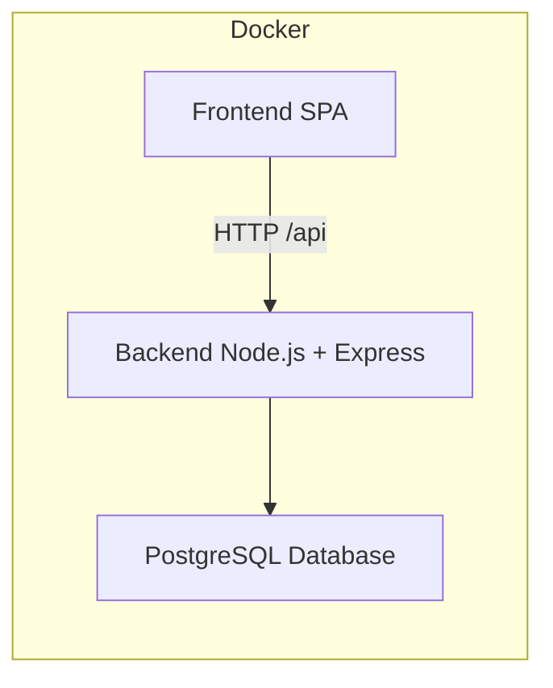

# TODO App - Sistema de Gestión de Tareas

## Descripción

Aplicación web para la gestión de tareas (TODO app) que permite crear, listar, actualizar y eliminar tareas. Cuenta con un backend en Node.js/Express con PostgreSQL y un frontend SPA servido con Nginx.

## Arquitectura



- **Frontend**: HTML + CSS + JavaScript servido por Nginx
- **Backend**: Node.js + Express + Sequelize ORM
- **Base de datos**: PostgreSQL
- **Orquestación**: Docker + Docker Compose
- **Migraciones automáticas**: Sequelize CLI

## Tecnologías

- **Backend**: Node.js, Express, Sequelize, PostgreSQL
- **Frontend**: HTML, CSS, JavaScript, Nginx
- **Orquestación**: Docker, Docker Compose
- **Control de versiones**: Git

## Requisitos Previos

- Docker 20+
- Docker Compose 2+
- Git

## Instalación y Ejecución

1. Clonar el repositorio:
   ```bash
   git clone https://github.com/usuario/todo-app.git
   cd todo-app
   ```

2. Levantar los servicios:
   ```bash
   docker-compose up --build
   ```

Esto iniciará:
- Base de datos PostgreSQL
- Backend Node.js/Express
- Frontend SPA con Nginx

## Acceder a la aplicación

- **Frontend**: http://localhost:8080
- **Backend API**: http://localhost:3000/api/task

## Comandos Útiles

- Levantar todos los servicios:
  ```bash
  docker-compose up --build
  ```

- Levantar en segundo plano:
  ```bash
  docker-compose up -d
  ```

- Detener los servicios:
  ```bash
  docker-compose down
  ```

## Estructura del Proyecto

```
todo-app/
├── backend/
│   ├── Dockerfile
│   ├── Dockerfile.migrator
│   ├── package.json
│   ├── .env
│   └── src/
│       ├── database/
│       │   ├── migrations/
│       │   ├── models/
│       │   └── seeders/
│       ├── modules/
│       │   └── task/
│       │       ├── controller.js
│       │       ├── service.js
│       │       ├── router.js
│       │       └── request.js
│       ├── errors/
│       ├── handlers/
│       ├── middlewares/
│       ├── routers/
│       └── utils/
├── frontend/
│   ├── Dockerfile
│   ├── index.html
│   ├── api.js
│   ├── input.css
│   ├── output.css
│   └── nginx.conf
└── docker-compose.yml
```

## Configuración de Docker Compose

El archivo `docker-compose.yml` define los siguientes servicios:
- `db_prod`: Base de datos PostgreSQL.
- `migrator`: Ejecuta migraciones automáticas con Sequelize CLI.
- `backend`: API REST con Node.js/Express.
- `frontend`: SPA servida por Nginx.

## Notas

- Asegúrate de configurar el archivo `.env` en el directorio `backend/` con las variables de entorno necesarias (por ejemplo, credenciales de la base de datos).
- El servicio `migrator` ejecuta las migraciones de la base de datos automáticamente antes de que el backend inicie.
- Los puertos expuestos son:
  - **Frontend**: 8080
  - **Backend**: 3000
  - **PostgreSQL**: 5432


